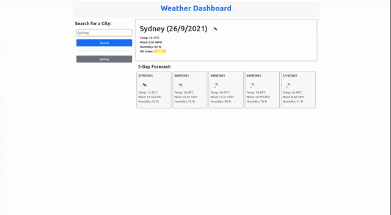

# 📖 Weather Dashboard

## 💡 The Dashboard

This is a server-side API dashboard using open API to get weather data. User can either enter a city name, or click on a history searched city to look up  it's current and future weather.

## 💡 The design

* There are 1 HTML, 1 CSS and 1 Javascript files.

* The index.html provides the fundamental layout of the web page using bootstrap.

* The script.js handles user clicks, store history data, retrive weather API data and render them on the dashboard.

* The style.css contains styles of the pages. Most styles are using bootstrap classes

* When the page loads, it automatically loads Sydney's weather if there's no local stored data. If there is, it loads the latest searched city data.

* If use clicks on the history data, it will use the city name and display the current and future weather (instead of display old weather data). So whenever a city is clicked, it calls the API again for the most updated data.

## 💡 Technologies used

* HTML
* CSS

## 💡 Links

* Please go to [LINK](https://shaotangyen.github.io/weather-forecast/) to check out the final page.

* Or [Link](https://github.com/shaotangyen/weather-forecast) to go to GitHub page.

## 💡 Demo

The following animation demonstrates the Weather Dashboard functionality:

## 💡 Contact

Shao Yen @ shaotang.yen02@gmail.com

---

## License

MIT License
Copyright (c) [2021] [WeatherDashboard]
Permission is herby granted, free of charge, to any person obtaining a copy of this software and associated documentation files (the "Software"), to deal in the Software without restriction, including without limiation the rights to use, copy, modify, merge, publish, distribute, sublicense, and/or sell copies of the Software, and to permit persons to whom the Software is furnished to do so, subject following coditions: 
The above copyright notice and this permission notice shall be included in all copies or substantial portions of the Software. 

THE SOFTWARE IS PROVIDED "AS IS", WITHOUT WARRANTY OF ANY KIND, EXPRESS OR IMPLIED, INCLUDING BUT NOT LIMITED TO THE WARRANTIES OF MECHANTABILITY, FITNESS FOR A PARTICULAR PURPOSE AND NONINFRINGEMENT. IN NO EVENT SHALL THE AUTHORS OR COPYRIGHT HOLDERS BE LIABLE FOR ANY CLAIM, DAMAGES OR OTHER LIABILITY, WHETHER IN AN ACTION OF CONTRACT, TORT OR OTHERWISE, ARISING FROM, OUT OF OR IN CONNECTION WITH THE SOFTWARE OR THE USE OF OTHER DEALINGS IN THE SOFTWARE.  
